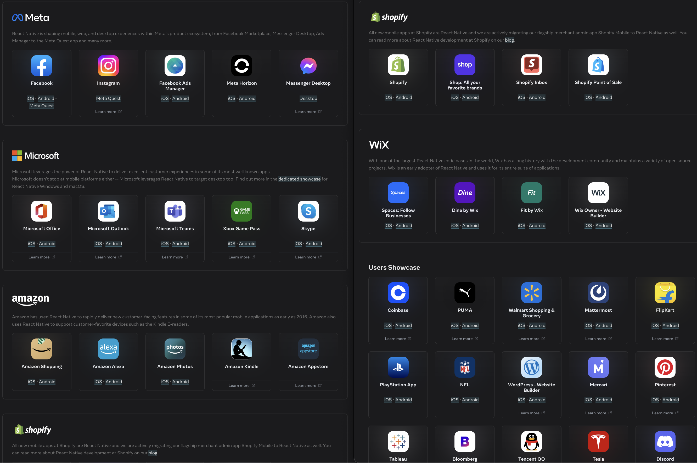
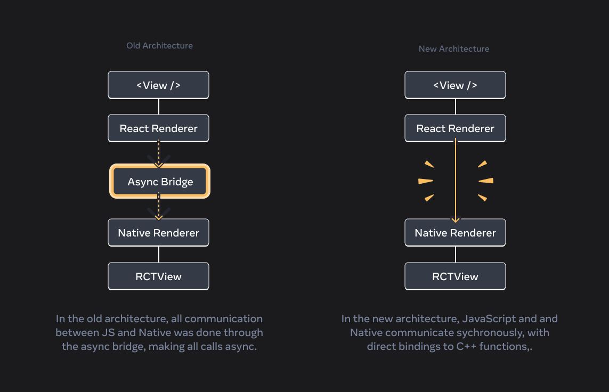
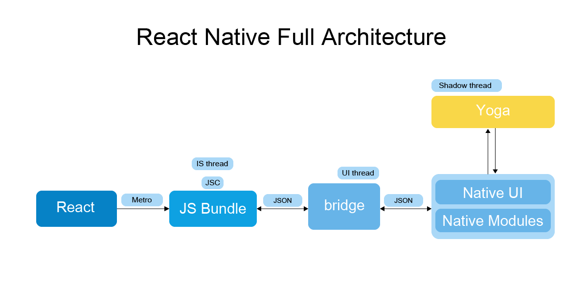
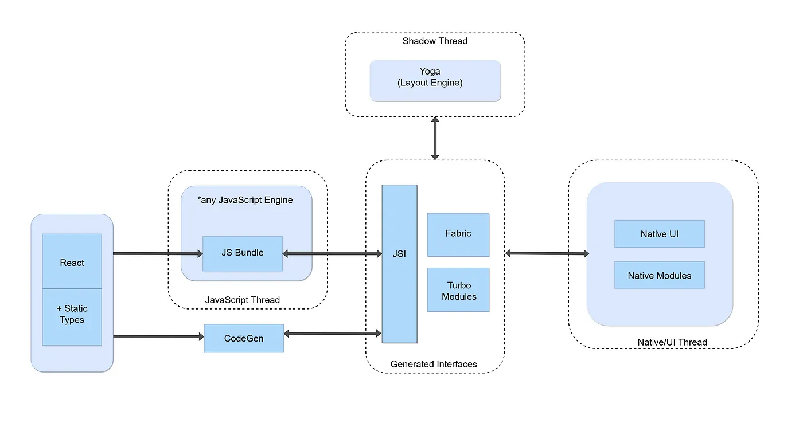
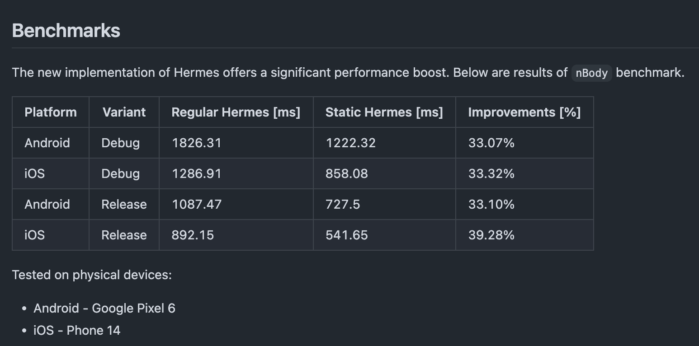
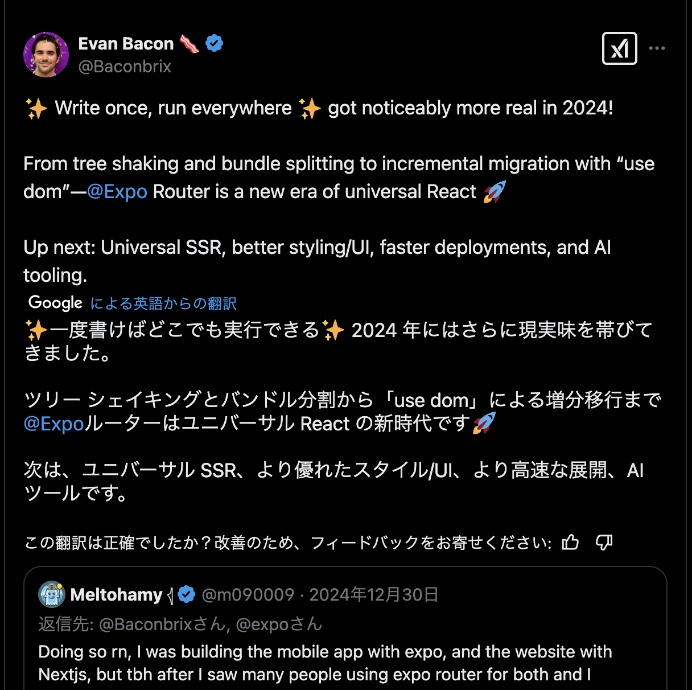
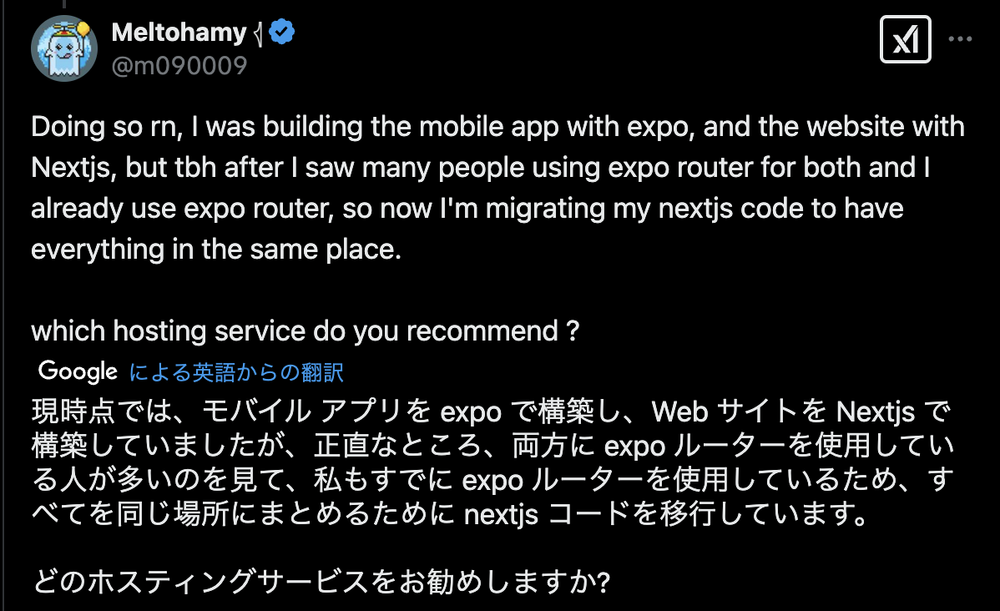
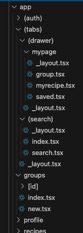

# React Native がアツいと聞いて

## React Native に興味持ち始めた自分の学習ログ

氏名: [@toki_dev](https://x.com/toki_dev)
日付: 2025 年 2 月 26 日

---

# 目次

- React Native の特徴
- 採用事例
- パフォーマンス
- Expo
- その他機能紹介
- まとめ

---

<!--
header: "**React Native の特徴**"
-->

# React Native の特徴

- React のスキルを転用してアプリの開発ができる
- 「Learn once, write anywhere」IOS, Android, Desktop, VR, web まで
- 本当にネイティブコード
- React のバージョンアップに追従する形で進化

---

# React と React Native のコード

<div class="split-flex gap-20">
<div class="left-50per">

### React

```typescript
const Componet = () => {
  const [state, setState] = useState();
  const handleHoge = () => {
    //...
  };

  return (
    <div>
      <p>テキスト</p>
      <button onClick={handleHoge}>ボタン</button>
    </div>
  );
};
```

</div>
<div class="right-50per">

### React Native

```typescript
const Component = () => {
  const [state, setState] = useState();
  const handleHoge = () => {
    //...
  };

  return (
    <View>
      <Text>テキスト</Text>
      <TouchableOpacity onPress={handleHoge}>
        <Text>ボタン</Text>
      </TouchableOpacity>
    </View>
  );
};
```

</div>
</div>

---

### React Native でのスタイリング

```typescript
export const Component = () => {
  return (
    <View style={styles.container}>
      <Text style={styles.title}>Hello React Native</Text>
    </View>
  );
};
const styles = StyleSheet.create({
  container: {
    flex: 1,
    justifyContent: "center",
    alignItems: "center",
  },
  title: {
    fontSize: 20,
  },
});
```

---

# コンポーネント対応表

| React Native   | iOS              | Android        | Web                   |
| -------------- | ---------------- | -------------- | --------------------- |
| `<View>`       | `<UIView>`       | `<ViewGroup>`  | `<div>`               |
| `<Text>`       | `<UITextView>`   | `<TextView>`   | `<p>`                 |
| `<Image>`      | `<UIImageView>`  | `<ImageView>`  | ``               |
| `<ScrollView>` | `<UIScrollView>` | `<ScrollView>` | `<div>`               |
| `<TextInput>`  | `<UITextField>`  | `<EditText>`   | `<input type="text">` |

<!--ネイティブコンポーネントにマッピングされて変換される-->

---

<!--
header: "**採用事例**"
-->

# 採用事例

<div class="split-flex">
<div class="left-40per">

Amazon, Microsoft, Discord など

海外では、
有名企業でも使われてる

<div class="mt-50"></div>

IOS, Android だけでなく
Desktop, Meta Quest(VR)でも

<div class="mt-50"></div>

[Showcase | React Native](https://reactnative.dev/showcase) 参考

</div>
<div class="right-60per">
  
</div>
</div>

---

<!--
header: "**パフォーマンス**"
-->

# パフォーマンス

React Native はパフォーマンスが悪いというイメージ

→ New Architecture や JavaScript エンジンの進化で大幅改善

---

# New Architecture

- React Native の基盤となる主要なシステムを完全に書き直し
- React Native 0.76、Expo SDK52 からデフォルト
- 2018 年から開発に取り組まれていた
- C++で書き直された

---

<div class="split-flex">
<div class="left-50per">

# <u>Old Architecture</u>

<div>

- 非同期ブリッジで Native と通信
  → JSON データのシリアル化必要
- 古いネイティブモジュールシステム
  → アプリ起動時に全て読み込み
- 古いレンダリングシステム
  → 非同期にしかレンダリングできない
- JavaScript エンジン
  → 主に JSC

</div>
</div>
<div class="split-50per">
<div>

# <u>New Architecture</u>

</div>
<div>

- JSI: 同期的に Native と通信
  → JSON データを使わず直接通信
- TurboModules (JSI 利用)
  → 必要な時に読み込み
- Fabric Renderer (JSI 利用)
  → 同期的にレンダリング可能
- JavaScript エンジン
  → Hermes

</div>
</div>
</div>

---

### Bridge の除去

<div class="box-center">


[参考](https://reactnative.dev/blog/2024/10/23/the-new-architecture-is-here#removing-the-bridge)

</div>

---

### Old Architecture

<div class="box-center">


[参考](https://github.com/facebook/react-native/issues/31469)

</div>

---

### New Architecture

<div class="box-center">


[参考](https://medium.com/@anisurrahmanbup/react-native-new-architecture-in-depth-hermes-jsi-fabric-fabric-renderer-yoga-turbo-module-1284a192a82b#:~:text=%F0%9F%9A%A9%20Flow%20of%20New%20Architecture)

</div>

---

# JavaScript エンジン

<div class="mt-50 box-center">

| 時期   | エンジン       | 説明                             |
| ------ | -------------- | -------------------------------- |
| 昔     | JavaScriptCore | 実行時にバイトコードを生成・実行 |
| 今     | Hermes         | 事前にバイトコードを生成         |
| 開発中 | Static Hermes  | 事前にネイティブコードを生成     |

</div>

---

### おまけ ( Static Hermes 採用提案のための Issue )

<div class="box-center mt-50">


<div class="mt-50"></div>

参考: GitHub Issue: [Static Hermes for React Native #48531](https://github.com/facebook/react-native/pull/48531)

</div>

---

<!--
header: "**Expo**"
-->

# Expo とは?

- Expo は「React Native フレームワーク」と「会社名」
- コアに含まれないネイティブ API（カメラ, ビデオ, 通知など）を提供
- ファイルベースのルーティングを提供 (Expo Router)
- アプリ用の設定やネイティブコードなどを楽に管理 (Expo CNG)
- Expo Modules API を利用してネイティブコードも書ける (Swift や Kotlin)
- API Routes でエンドポイントも作れる
- Expo Application Services という有料サービスもある
  (EAS Build, EAS Update, EAS Hosting...)

---

## 公式でもフレームワークの利用が推奨

> 新しいアプリを作成する場合、Expo などの React Native フレームワークを使用することが推奨されるようになりました。
> ...
> 現時点では、React Native に推奨される唯一のコミュニティ フレームワークは Expo です。Expo のスタッフは、React Native の初期の頃から React Native エコシステムに投資しており、現時点では、Expo が提供する開発者エクスペリエンスは最高クラスであると考えています。 (google 翻訳) [参考](https://reactnative.dev/blog/2024/06/25/use-a-framework-to-build-react-native-apps#:~:text=%E6%96%B0%E3%81%97%E3%81%84%E3%82%A2%E3%83%97%E3%83%AA%E3%82%92%E4%BD%9C%E6%88%90%E3%81%99%E3%82%8B%E5%A0%B4%E5%90%88%E3%80%81Expo%20%E3%81%AA%E3%81%A9%E3%81%AE%20React%20Native%20%E3%83%95%E3%83%AC%E3%83%BC%E3%83%A0%E3%83%AF%E3%83%BC%E3%82%AF%E3%82%92%E4%BD%BF%E7%94%A8%E3%81%99%E3%82%8B%E3%81%93%E3%81%A8%E3%81%8C%E6%8E%A8%E5%A5%A8%E3%81%95%E3%82%8C%E3%82%8B%E3%82%88%E3%81%86%E3%81%AB%E3%81%AA%E3%82%8A%E3%81%BE%E3%81%97%E3%81%9F%E3%80%82)

---

### おまけ: Web まで Expo で作ってしまうパターンも

<div class="split-flex gap-20">
<div class="left-40per">

</div>
<div class="right-40per">

</div>
</div>

<div class="center">

[Tweet](https://x.com/m090009/status/1873731110892458129)

</div>

---

# Expo Router

<div class="split-flex gap-20">
<div class="left-20per">

</div>
<div class="right-80per">

- ファイルシステムベースのルーティング
  (`/`, `/search`, `/mypage/saved`, `/mypage/myrecipe` ..みたいな感じ)
- `()`でグルーピングでき、階層ごとに`_layout`の指定ができる
- React Navigation のラッパーで、多くの概念が同じ
- 細かい仕様は「React Navigation」で検索した方が良い場合がある
  (expo-router から import してても)
- [サンプル](https://toki-dev.vercel.app/tools/expo-navigation-gallery)、[zenn](https://zenn.dev/toki_dev/articles/92a08b7bc5758f)

</div>
</div>

---

<!--
header: "**その他、機能紹介とか**"
-->

# その他、機能紹介とか

---

# React Server Components

- Expo で開発者プレビューがリリースされた [(参考)](https://expo.dev/blog/universal-react-server-components-developer-preview)
- 嬉しいこと
  - UI を瞬時に更新
  - アプリサイズの削減
  - シークレット情報とか扱える

---

# DOM Components

- Web 用のコンポーネントを React Native で表示できる (内部的には WebView)
- 爆速でアプリ移行して、徐々に React Native に置き換えていけるのが推しポイント
- `use dom` ディレクティブで使える
- Web 用のコンポーネントに Native の関数を渡せる

<div class="split-flex gap-20">
<div class="left-50per">

```typescript
"use dom";

export default function MyComponent({
  hello,
}: {
  hello: (data: string) => Promise<void>;
}) {
  return <p onClick={() => hello("world")}>Click me</p>;
}
```

</div>
<div class="right-50per">

```typescript
import DomComponent from "./my-component";

export default function App() {
  return (
    <DomComponent
      hello={(data: string) => {
        console.log("Hello", data);
      }}
    />
  );
}
```

</div>
</div>

---

<!--
header: ""
-->

# まとめ

- 進化してる React Native がアツい！
- いろんな理由で将来性がある！
  (パフォーマンス,React ユーザー増加,RSC などの React 最新機能,VR など)
- 今年は React Native をがっつり学びます！ (一緒に学びましょ)
- いつかの Next.js の競合は Expo かも?

---

# おまけ:

- 最初に読むのに良さそうな記事 ( React から React Native に入門する記事 )
  - [From Web to Native with React | Expo Blog](https://expo.dev/blog/from-web-to-native-with-react)
- 深いところまで理解するのに良さそうな記事
  - [React-Native-Advanced-Guide](https://github.com/anisurrahman072/React-Native-Advanced-Guide)
- React Native のライブラリを探すツール
  - [React Native Directory](https://reactnative.directory/)
  - [Raycast の拡張もある](https://www.raycast.com/shubh_porwal/react-native-directory)
